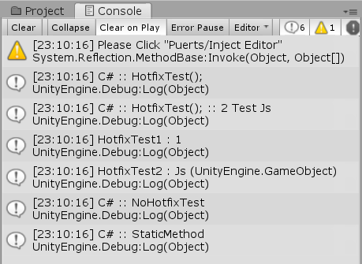
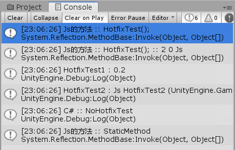

### 使用Js修复Unity的C#端代码

#### 快速开始：

##### 编辑器注入:
    Puerts/Inject Editor
##### 清除注入（重新编译代码）:
    Puerts/Inject Clear (Script Compilation)

##### Js执行Patch:

    if (!puerts.hotfix.isInject) {
        console.warn('Please Click "Puerts/Inject Editor"');
        return;
    }

    // 普通方法
    puerts.hotfix.patch(CS.PuertsTest.JsHotfixTest, 'HotfixTest1', (self) => {
        return 0.2;
    });
    puerts.hotfix.patch(CS.PuertsTest.JsHotfixTest, 'HotfixTest2', (self) => {
        return new CS.UnityEngine.GameObject("Js HotfixTest2");
    });

    // 第三个参数为方法id, 会生成在hotfix_map.js.txt中
    // 重载方法
    puerts.hotfix.patchId(CS.PuertsTest.JsHotfixTest, 'HotfixTest', 0, (self) => {
        console.log('Js的方法 :: HotfixTest();');
    });
    puerts.hotfix.patchId(CS.PuertsTest.JsHotfixTest, 'HotfixTest', 1, (self, hotfixTest, testEnum, go) => {
        console.log('Js的方法 :: HotfixTest(); :: ' + hotfixTest + " " + testEnum + " " + go.name);
    });

    // 静态方法
    puerts.hotfix.patch(CS.PuertsTest.JsHotfixTest, 'StaticMethod', () => {
        console.log('Js的方法 :: StaticMethod');
    });

##### 配置:
##### 需要注入的Type列表： [HotfixList]
    [HotfixList]
    static IEnumerable<Type> Hotfixs
    {
        get
        {
            return new List<Type>()
            {
                typeof(PuertsTest.JsHotfixTest),
            };
        }
    }

##### 过滤器： [HotfixFilter]
    // 觉得JsHotfixTest类里的函数可能会需要修复，但是Test类里面的某个方法不可能有问题，可以把这两个函数过滤掉。
    [HotfixFilter]
    static bool Filter(System.Reflection.MethodInfo methodInfo)
    {
        return methodInfo.DeclaringType.FullName == "PuertsTest.JsHotfixTest"
            && ( (methodInfo.Name == "NoHotfixTest") || (methodInfo.Name == "Awake") );
    }

##### 生成注入的hotfix_map.Js代码的路径： [HotfixCodeDirectory]
    [HotfixCodeDirectory] // Hotfix生成的Js文件路径
    public static string HotfixCodeDir { get { return Application.dataPath + "/Js/PuertsHotfix/Resources/"; } }

##### 获取类型的配置： [HotfixConfig]
    // 获取类型的配置
    [HotfixConfig]
    static HotfixConfig GetHotfixConfig(Type type)
    {
        return HotfixConfig.GetDefault();
    }

    public struct HotfixConfig
    {
        /// 
 是否忽略非public方法 

        public bool ignoreNotPublic;

        public static HotfixConfig GetDefault()
        {
            return new HotfixConfig { ignoreNotPublic = false };
        }
    }

 

##### 生成的hotfix_map.js：
    module.exports = {
        "PuertsTest.JsHotfixTest": {
            "Start": [
                "", // 0
            ],
            "HotfixTest": [
                "", // 0
                "System.Int32 hotfixTest, PuertsTest.JsHotfixTest/TestHotfixEnum testEnum, UnityEngine.GameObject go", // 1
            ],
            "HotfixTest1": [
                "", // 0
            ],
            "HotfixTest2": [
                "", // 0
            ],
            "StaticMethod": [
                "", // 0
            ],
            "OnDestroy": [
                "", // 0
            ],
        },
    }

##### 示例:
    Assets/PuertsHotfix/Example/Main.Unity

<!-- 
 -->
